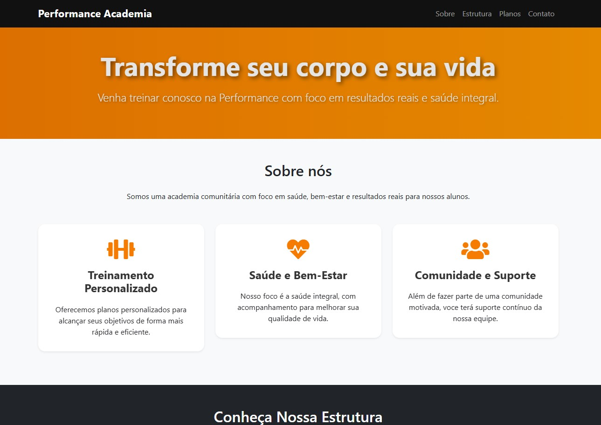
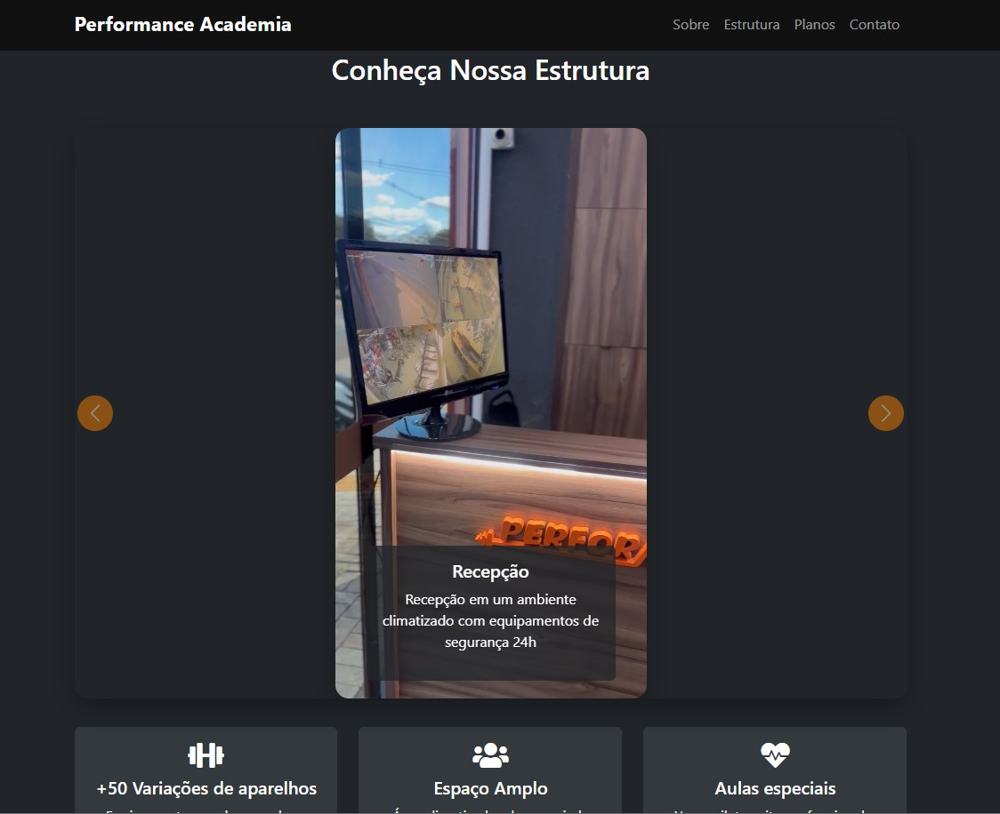

# Performance Academia

Este é um projeto/site desenvolvido como parte de um projeto de extensão de curso da faculdade Descomplica(PEX).





> 💡 Imagens capturadas diretamente do site.

---

## Tecnologias usadas

- HTML
- CSS (com variáveis e animações)
- Bootstrap

## Funcionalidades

- Página inicial com banner chamativo (hero)
- Sessão "Sobre" com cartões informativos animados
- Carrossel de vídeos verticais no estilo Instagram Reels
- Sessão com destaque para o Instagram da academia
- Design responsivo e moderno com efeitos sutis

## 🎥 Destaques Visuais

- 🌈 Botões com gradiente do Instagram
- 💻 Layout responsivo adaptado para celular, tablet e desktop
- 🎞️ Carrossel de vídeos verticais com controles personalizados

## Como rodar o projeto localmente

1. Clone o repositório:
   ```bash
   git clone https://github.com/SeuUsuario/Performance-Academia.git

2. Navegue até o diretório do projeto: 
    cd Performance-Academia

3. Abra o arquivo index.html no seu navegador

